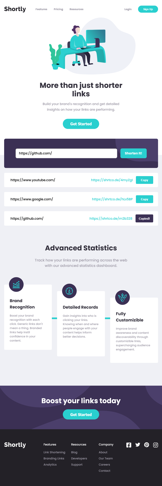

# URL Shortening API Master

My solution to [URL shortening API landing page challenge](https://www.frontendmentor.io/challenges/url-shortening-api-landing-page-2ce3ob-G)  on Frontend Mentor.

- A user gets to shorten their links by using [https://shrtco.de/](https://shrtco.de/) API;
- The app made with Create React App and react library [react-copy-to-clipboard](https://www.npmjs.com/package/react-copy-to-clipboard);
- Font Awesome icons using [Free License](https://fontawesome.com/license/free). 

The project deployed to GitHub with [gh-pages](https://www.npmjs.com/package/gh-pages) package. *Gh-pages* branch contains the build.


- Live Site URL: [GitHub Pages](https://xs30snw.github.io/FEM_url-shortening-api-master/)

## Screenshot



## File structure

```
.
├── README.md               # Project description
├── build                   # CRA production build
├── package.json            # NPM meta and dependencies 
├── public                  # Public dev files
│   ├── index.html          # React app is injected into here
├── screenshot.png          # Project preview
└── src                     # Dev source files
    ├── App.js              # Main React app
    ├── components          # React components with local styles
    ├── index.css           # General styles
    ├── index.js            # CRA entry
    └── media               # Media files
```

## Tested

- Win 10:
    - Chrome v98,
    - Firefox v97.

## Ideas for improvement

- [ ] Copy button doesn't copy after the first click;
- [ ] URL validation and error handling on client side.